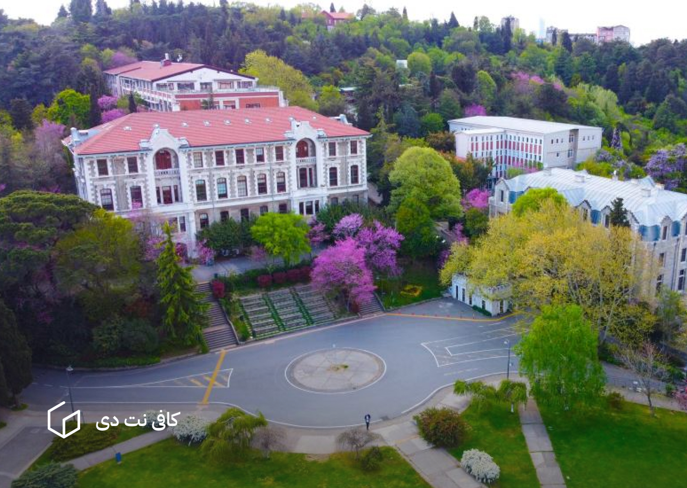

دانشگاه بغازیچی ترکیه یکی از دانشگاه های ترکیه است که می تواند دانشگاه منتخب شما برای ادامه تحصیلات تان در این کشور باشد. 

## معرفی دانشگاه بغازیچی ترکیه - Boğaziçi University

در سال 1863 سایروس هاملین و کریستوفر رابرت، کالج رابرت را در استانبول تأسیس کردند. پس از صد سال استفاده به‌عنوان بخشی از کالج، پردیس جنوبی آن در سال 1971 برای تأسیس یک دانشگاه مستقل تخصیص داده و دانشگاه بغازیچی تأسیس شد. امروزه این دانشگاه در فضایی با مساحت 1,672,106 متر مربع و در هفت پردیس آموزش رشته‌های مختلف را به زبان انگلیسی ارائه می‌دهد. دانشگاه بغازیچی به یکی از دانشگاه‌های مورد علاقه دانشجویانی تبدیل شده که بالاترین نمرات را در آزمون مؤسسات آموزش عالی کسب کردند.

دانشگاه بغازیچی دارای 33 رشته کارشناسی، 67 رشته کارشناسی‌ارشد و 33 رشته دکتری در 7 دانشکده، 1 مدرسه عالی، 7 مؤسسه تحصیلات تکمیلی است. در این دانشگاه 436 عضو هیئت علمی تمام‌وقت (پروفسور، دانشیار، استادیار)، 142 مدرس، 82 عضو هیئت علمی خارجی، 230 دستیار پژوهشی و 751 کارمند اداری مشغول به کار هستند. همچنین در حال حاضر در مجموع 16497 دانشجو که 13116 نفر آن‌ها در مقطع کارشناسی و 3381 نفر آن‌ها در رشته‌های تحصیلات تکمیلی در حال دریافت خدمات آموزشی هستند، در دانشگاه بغازیچی در ترکیه تحصیل می‌کنند.  دانشگاه بغازیچی به عنوان یکی از دانشگاه‌های برتر ترکیه شناخته می‌شود و رتبه دوم در سطح ملی  است. در این دانشگاه دانشجویان خارجی تقریباً از 40 کشور در چارچوب 496 توافق نامه و برنامه‌های تبادل دانشجویی منعقد شده با دانشگاه‌های جهان، در حال تحصیل هستند.

## اطلاعات مهم دانشگاه

- مورد تایید وزارت علوم: بله
- مورد تایید وزارت بهداشت: بله
- شهریه: بین 300 تا 500 میلیون تومان
- شهر: [شهر استانبول](istanbul.md)
- ایمیل دانشگاه: [info@bogazici.edu.tr](mailto:info@bogazici.edu.tr)
- وبسایت دانشگاه: [https://bogazici.edu.tr](https://bogazici.edu.tr/)

## تاریخ ثبت‌نام

تاریخ ثبت‌نام دانشگاه بغازیچی از 18 تیر تا 25 تیر (9 ژوئیه تا 26 ژوئیه) است. نتایج 4 تا 6 هفته بعد از ثبت‌نام در وبسایت دانشگاه بغازیچی اعلام خواهد شد.

## حداقل امتیازهای مورد نیاز برای پذیرش

[آزمون آیلتس](ielts-exam.md): 6.5 با حداقل 6.5 در بخش نوشتاری آزمون از 9

[آزمون تافل](toefl-exam.md): 79 از 120

[آزمون اس ای تی](sat-exam.md): 
- برای رشته‌های مهندسی 740 از 800 نمره در بخش ریاضی و 1450 از 1600 برای نمره کل
- برای سایر رشته‌ها 680 از 800 نمره برای بخش ریاضی و 1400 از 1600 برای نمره کل

توجه داشته باشید که دانشگاه بغازیچی فقط با آزمون اس‌ای‌تی پذیرش دارد و نمی‌توان از نمره آزمون یوس برای اپلای کردن استفاده کرد.
## مدارک مورد نیاز

- ریزنمرات دبیرستان
- دیپلم یا مدرک فارق‌التحصیلی از دبیرستان
- برگه نمره آزمون اس‌ای‌تی
- مدرک زبان آیلتس یا تافل
- انگیزه‌نامه برای ادامه تحصیل در رشته مورد نظر به زبان انگلیسی 
- پاسپورت
- رسید پرداخت هزینه ثبت‌نام

## رشته ها و شهریه

دانشگاه بغازیچی با وجود این که از جمله برترین دانشگاه‌های کشور ترکیه است، شهریه نسبتاً ارزانی دارد. به‌منظور اطلاع دقیق شما، در جدول زیر شهریه رشته‌های این دانشگاه را در سال تحصیلی 2024-2025 آورده‌ایم: 

| رشته                         | شهریه به لیر برای سال تحصیلی 2024-2025 |
| ---------------------------- | -------------------------------------- |
| مهندسی کامپیوتر              | 45,000                                 |
| مدیریت                       | 40,000                                 |
| جامعه‌شناسی                  | 45,000                                 |
| زیست شناسی مولکولی و ژنتیک   | 45,000                                 |
| مهندسی صنایع                 | 45,000                                 |
| شیمی                         | 45,000                                 |
| اقتصاد                       | 40,000                                 |
| علوم سیاسی و روابط بین‌الملل | 40,000                                 |
| مهندسی عمران                 | 45,000                                 |
| ریاضیات                      | 40,000                                 |
| حقوق                         | 40,000                                 |
| مهندسی ماشین‌آلات            | 45,000                                 |
| مشاوره روانشناسی             | 40,000                                 |
| مهندسی شیمی                  | 45,000                                 |
| فلسفه                        | 40,000                                 |

## آدرس

دانشگاه بغازیچی در مرکز شهر استانبول، در محله آرناووتکوی (Arnavutkoy) واقع است. برای دیدن آدرس این دانشگاه روی نقشه به لینک زیر مراجعه نمایید.

[آدرس در گوگل مپس](https://www.google.com/maps/place/Boğaziçi+University/@41.0836151,29.0517642,17z/data=!3m1!4b1!4m6!3m5!1s0x14cac9ff47fbad73:0xbd6495985c46cd0e!8m2!3d41.0836151!4d29.0517642!16zL20vMDJ2eG1o?entry=ttu&g_ep=EgoyMDI1MDEwOC4wIKXMDSoASAFQAw%3D%3D)

<iframe src="https://www.google.com/maps/embed?pb=!1m18!1m12!1m3!1d3007.3309507304316!2d29.051764199999997!3d41.083615099999996!2m3!1f0!2f0!3f0!3m2!1i1024!2i768!4f13.1!3m3!1m2!1s0x14cac9ff47fbad73%3A0xbd6495985c46cd0e!2zQm_En2F6acOnaSBVbml2ZXJzaXR5!5e0!3m2!1sen!2s!4v1739342046088!5m2!1sen!2s" class="aspect-video w-full rounded-md mb-5" style="border:0;" allowfullscreen="" loading="lazy" referrerpolicy="no-referrer-when-downgrade"></iframe>

## دیگر دانشگاه‌های ترکیه

برای مشاهده لیست کامل دانشگاه های ترکیه می توانید به صفحه زیر مراجعه کنید. 

[لیست کامل دانشگاه های ترکیه](turkiye-universities.mdx)
