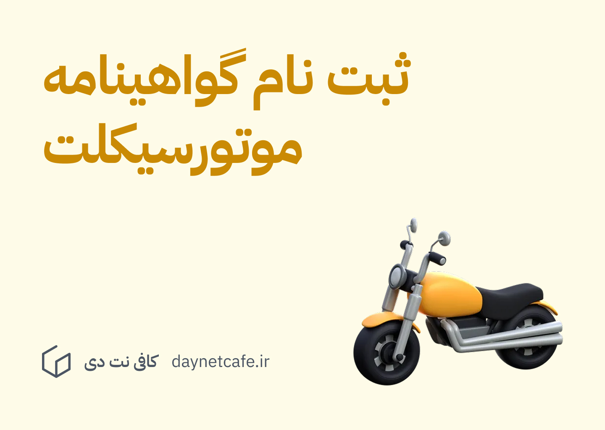

در این پست همه آموزشگاه های رانندگی موتورسیکلت استان گلستان و همینطور اطلاعات مورد نیاز دیگر را لیست کرده ایم. همینطور اطلاعات مهمی نیز در مورد ثبت نام گواهینامه موتورسیکلت در استان گلستان را می توانید در این مقاله بخوانید. 

## آموزشگاه های رانندگی موتورسیکلت گلستان

### 1) آموزشگاه رانندگی موتورسیکلت سینا گرگان

- مرکز آزمون: مرکز آزمون پلیس راهور گرگان
- آدرس: گرگان کیلومتر 2 جاده گنبد مقابل پمپ بنزین کندوان
- شماره تماس: [01732167144](tel:01732167144)
- [مسیریابی نقشه گوگل](https://www.google.com/maps/place/%D8%A2%D9%85%D9%88%D8%B2%D8%B4%DA%AF%D8%A7%D9%87+%D8%B1%D8%A7%D9%86%D9%86%D8%AF%DA%AF%DB%8C+%D9%85%D9%88%D8%AA%D9%88%D8%B1+%D8%B3%DB%8C%DA%A9%D9%84%D8%AA+%D8%B3%DB%8C%D9%86%D8%A7%E2%80%AD/@36.8500307,54.4977249,831m/data=!3m2!1e3!4b1!4m6!3m5!1s0x3f83377c9e6f5109:0x8c4806865dac7519!8m2!3d36.8500264!4d54.5003052!16s%2Fg%2F11fm787r56?entry=ttu&g_ep=EgoyMDI1MDIxOS4xIKXMDSoASAFQAw%3D%3D)

### 2) آموزشگاه رانندگی موتورسیکلت گلستان گرگان

- مرکز آزمون: مرکز آزمون پلیس راهور گرگان
- آدرس: گرگان کیلومتر 2 جاده گنبد
- شماره تماس: [01775822711](tel:01775822711)
- [مسیریابی نقشه گوگل](https://www.google.com/maps/place/%D9%85%D8%AC%D8%AA%D9%85%D8%B9+%D8%A2%D9%85%D9%88%D8%B2%D8%B4+%D8%B1%D8%A7%D9%86%D9%86%D8%AF%DA%AF%DB%8C+%DA%AF%D9%84%D8%B3%D8%AA%D8%A7%D9%86%E2%80%AD/@36.8525566,54.5002566,831m/data=!3m2!1e3!4b1!4m6!3m5!1s0x3f83373b2fd9dfab:0xe10e9eb1053d095d!8m2!3d36.8525523!4d54.5028369!16s%2Fg%2F11fm5x4rjp?entry=ttu&g_ep=EgoyMDI1MDIxOS4xIKXMDSoASAFQAw%3D%3D)

### 3) آموزشگاه رانندگی موتورسیکلت صادقی مینودشت

- مرکز آزمون: مرکز آزمون پلیس راهور شهرستان مینودشت
- آدرس: مینودشت خیابان کمیل روبه روی اکبر جوجه
- شماره تماس: [01735282080](tel:01735282080)
- [مسیریابی نقشه نشان](https://nshn.ir/88_bWlkn5jY7ED)

### 4) آموزشگاه رانندگی موتورسیکلت هاوش کلاله

- مرکز آزمون: مرکز آزمون پلیس راهور شهرستان کلاله
- آدرس: کلاله میدان امام ره خ طالقانی انتهای خیابان
- شماره تماس: [09356674479](tel:09356674479)
- [مسیریابی نقشه گوگل](https://www.google.com/maps/place/%D8%A2%D9%85%D9%88%D8%B2%D8%B4%DA%AF%D8%A7%D9%87+%D9%85%D9%88%D8%AA%D9%88%D8%B1%D8%B3%DB%8C%DA%A9%D9%84%D8%AA+%D9%87%D8%A7%D9%88%D8%B4%E2%80%AD/@37.3745995,55.4806841,826m/data=!3m2!1e3!4b1!4m6!3m5!1s0x3f82a158ef34bb75:0xb67035c9f19a3028!8m2!3d37.3745953!4d55.4832644!16s%2Fg%2F11fd6twy15?entry=ttu&g_ep=EgoyMDI1MDIxOS4xIKXMDSoASAFQAw%3D%3D)

### 5) آموزشگاه رانندگی موتورسیکلت تلاش علی آباد کتول (پیشنهاد ما)

- مرکز آزمون: مرکز آزمون پلیس راهور شهرستان علی آباد کتول
- آدرس: علی آباد کتول شهرک فرهنگیان خ بنیاد شهید
- شماره تماس [09119671090](tel:09119671090)
- [مسیریابی آموزشگاه رانندگی موتورسیکلت تلاش علی آباد کتول در نقشه گوگل](https://www.google.com/maps/place/%D8%A2%D9%85%D9%88%D8%B2%D8%B4%DA%AF%D8%A7%D9%87+%D8%AA%D9%84%D8%A7%D8%B4+%D8%B9%D9%84%DB%8C+%D8%A7%D8%A8%D8%A7%D8%AF+%DA%A9%D8%AA%D9%88%D9%84%E2%80%AD/@36.9008355,54.8333708,831m/data=!3m2!1e3!4b1!4m6!3m5!1s0x3f82d5002849dcc7:0x315dd2ace536bed1!8m2!3d36.9008312!4d54.8359511!16s%2Fg%2F11w2hkdfc0?entry=ttu&g_ep=EgoyMDI1MDIxOS4xIKXMDSoASAFQAw%3D%3D)
- [مسیریابی مرکز آزمون پلیس راهور شهرستان علی آباد کتول در نقشه گوگل](https://maps.app.goo.gl/hfUvDUtMWkPVdv848) (محل برگزاری آزمون)

## کدام آموزشگاه موتورسیکلت در استان گلستان بهتر است؟

اینکه کدام آموزشگاه را برای دریافت گواهینامه یک روزه موتورسیکلت انتخاب می کنید بستگی به شرایط خودتان مانند فاصله تان از آموزشگاه دارد. 

اما با توجه به تجربه ای که در کافی نت دی داریم، بهترین آموزشگاه رانندگی موتورسیکلت برای دریافت گواهینامه موتورسیکلت یک روزه در استان گلستان، **آموزشگاه رانندگی تلاش علی آباد کتول** می باشد. 

دوستانی که در شهرستان گنبد کاووس و روستاهای اطراف ساکن هستند، می توانند هر کدام از آموزشگاه هایی را که به نظرشان بهتر هست انتخاب کنند. همینطور در بازه های هفتگی، از طرف آموزشگاه موتورسیکلت سینا گرگان نیز یک افسر راهنمایی رانندگی به گنبد می آید و آزمون گواهینامه موتورسیکلت در گنبد کاووس گرفته می شود. در این پست بیشتر توضیح داده ایم: 

- [ثبت نام و دریافت گواهینامه موتورسیکلت یک روزه در شهرستان گنبد کاووس](motor-license-gonbad.md)

## زمان مراجعه به آموزشگاه های موتورسیکلت جهت شرکت در آزمون چه ساعتی است؟ 

در آموزشگاه های رانندگی موتورسیکلتی که در بالا اشاره کردیم آزمون های گواهینامه موتورسیکلت **همه روزه از ساعت 12 ظهر به بعد** برگزار می شود. لازمه شرکت در این آزمون هم ثبت نام در سامانه ایرانیان موتور و دریافت کارتکس شرکت در آزمون می باشد. 

## چگونه گواهینامه موتورسیکلت یک روزه را دریافت کنم؟ 

در این پست، مدارک مورد نیاز و مراحل دریافت گواهینامه موتورسیکلت یک روزه را توضیح داده ایم: 

- [آموزش ثبت نام و دریافت گواهینامه موتورسیکلت یک روزه](motor-license.md)

برای دوستانی که در استان گلستان می خواهند برای این گواهینامه درخواست ثبت کنند، در کافی نت دی برایشان انجام می دهیم: 

- [ثبت نام گواهینامه موتورسیکلت یک روزه](../services/motor-license-signup.md)
