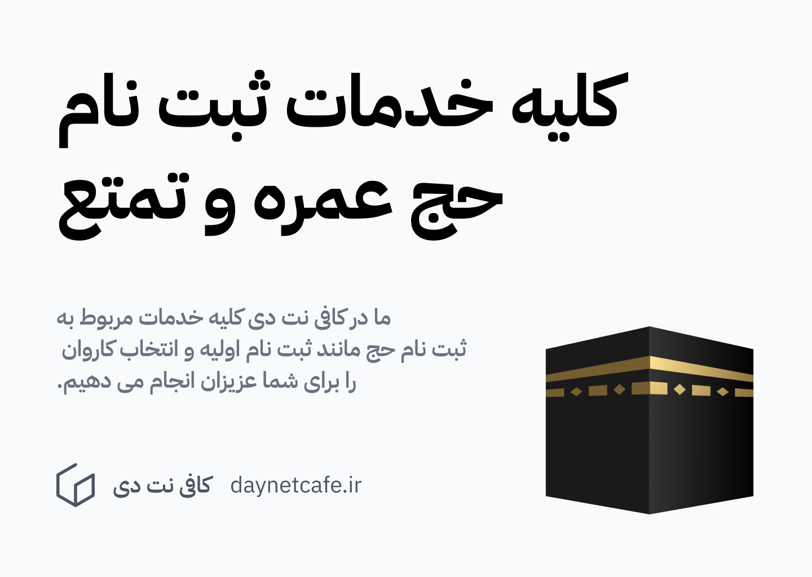

---
aliases:
  - لیست کاروان های حج تمتع 1404 استان گلستان
description: در این مقاله قصد دارم تا کاروان های  حج تمتع سال 1404 در استان گلستان را به شما عزیزان معرفی کنم.
date: 2025-04-13
tags:
  - وبلاگ
  - حج
  - کاروان
  - تمتع
image: ../media/haj-tamato-1404-karavans-golestan.jpg
authors:
  - zachshirow
  - hemra
---

در این مقاله قصد دارم تا کاروان های حج تمتع سال 1404 در استان گلستان را به شما عزیزان معرفی کنم.

شکر خدا در سال های اخیر که حج تمتع و عمره داره انجام میشه و مردم با ایمان که خواستار رفتن به حج تمتع هستند می توانند در سامانه حج و زیارت به آدرس https://my.haj.ir درخواست خودشون رو ثبت کنند. 

مرحله اول ثبت نام حج تمتع، پیش ثبت نام و پرداخت مبلغ پیش ثبت نام هست. سپس بعد از گذشت مدتی، از طرف سازمان حج و زیارت از کسانی که پیش ثبت نام انجام داده اند دعوت می شود تا کاروان حج خود را انتخاب کنند. همه ساله تعداد محدودی کاروان به هر استان و شهر اختصاص داده می شود و حاجیان باید از بین این کاروان ها، کاروان مورد نظر خود را که دارای ظرفیت هست انتخاب کنند. 

در این مقاله، از آنجایی که ما در کافی نت دی در استان گلستان قرار داریم و ارادت ویژه ای به هم استانی هایمان داریم، لیست کاروان های این استان را نوشته ایم تا در انتخاب کاروان بتوانیم به شما کمک کنیم. سایر مخاطبین که در استان های دیگر قرار دارید، می توانید [از طریق این لینک](https://kargozaran.haj.ir/OfficeRelated/SearchOfficePublic.aspx)، کاروان های استان خود را مشاهده کنید.  

واجدین شرایط ثبت نام:

- الف) افرادی که بر اساس اعلام قبلی سازمان حج و زیارت با مراجعه به سامانه [my.haj.ir](https://my.haj.ir) اقدام به پیش ثبت‌نام نموده و وجه مربوطه را واریز کرده‌اند.
- ب) افرادی که در کاروان‌های حج تمتع سال 1399 نام‌نویسی، وجوه مربوطه را پرداخت و تاکنون انصراف نداده‌اند.

لیست کاروان های حج تمتع سال 1404 در استان گلستان

|ردیف|شماره کاروان|مدینه|نام مدیر|نام خانوادگی|ظرفیت زائر|تلفن|موبایل مدیر|آدرس|
|---|---|---|---|---|---|---|---|---|
|1|38066|بعد|سیدضیا|حسینی|170|32250516|9112704972|خیابان شهدا، خیابان لاله سوم، مجتمع لاله، طبقه اول|
|2|38083|بعد|محمدرضا|زنگانه|95|34224146|9111758730|چهار راه بازار (قصر) ، خیابان شهید قندی ، کوچه مطهر یک|
|3|38019|بعد|حسین|طالع زاری|165|35230185|9112740080|خیابان ولیعصر(عج)، جنب پمپ بنزین|
|4|38055|بعد|عبدی|نیازی|170|34521790|9113703669|خیابان امام خمینی جنوبی ، جنب مسجد سوقی|
|5|38051|بعد|عطاالله|قورچائی|170|33333152|9120770367|خیابان امام خمینی (ره )جنوبی خیابان شهیده منا ساراگل شیروانی (راهنمایی سابق) نرسیده به بلوار سینا|
|6|38077|بعد|عبدالغفور|فرزان فر|170|33266706|9111792946|گنبد کاووس تقاطع بلوار سینا و بلوار امامزاده / ابتدای بلوار امامزاده به سمت حرم حضرت یحیی بن زید(ع)پ|
|7|38038|بعد|حاجی گلدی|ایری|170|34482006|9113771750|بندرترکمن مابین ابوعمار11و13|
|8|38328|بعد|اسماعیل|سلاق|170|34530284|9113732267|آق قلا خیابان مسکین قلیچی نبش مسکین 5 روبروی مسجد امام حسین|
|9|38056|بعد|عبدالقادیر|یموتی|170|35441725, 35448725|9058721250|خیابان امام خمینی ( ره ) جنوبی ، خیابان شهید شاددل ، روبروی بوستان ساحلی|
|10|38060|بعد|دردی|کمی|170|34428493|9119718239|بندر ترکمن، بلوار آزادی، روبروی شهرداری، پاساژ طلافروشان، پلاک 9، طبقه اول، واحد 15|
|11|38013|بعد|محمد|میرزایی اصل|170|33223771|9113753629|خیابان امام خمینی شمالی، خیابان مطهری شرقی، مجتمع دنیز، طبقه دوم، واحد 72|
|12|38078|بعد|یوسف|دوجی|165|35453077|9113743122|مراوه تپه - خیایان امام خمینی (ره)، بین خیابان فرهنگ 2 و 4|
|13|38001|بعد|محمد|اسلامی|170|34535721|9111756544|آق قلا - بلوار نماز 7 - روبروی دارایی - جنب بیمارستان|
|14|38082|بعد|عبدالوهاب|ایمرعلی|170|34472540|9111783660|سیمین شهر- محله بناور ،خیابان آزادی ، آزادی 4 ، سمت راست طبقه همکف|
|15|38032|بعد|فریدون|شریعتی|170|34484741|9111784367|شهرستان ترکمن بخش مرکزی شهر بندر ترکمن محله شهرک شیلات خیابان شهید رجایی بین بهشت 7 و 9 پلاک 324|
|16|38053|بعد|عبدالجبار|فرزان فر|165|33293586|9113743616|گنبد کاووس بخش مرکزی شهر گنبد خیابان میهن شرقی بین خیام و حافظ جنب مسجد قجقی ساختمان آرمان طبقه 1 و|
|17|38049|بعد|کمال الدین|پایون قرنجیک|165|34465689|9113775727|گمیش تپهُ میدان امام خمینی (ره)ُ دفتر زیارتی آلتین خزر|
|18|38099|بعد|احمد|شادان|165|34537214|9112782964|آق قلا بخش مرکزی خیبان امام خمینی خیابان شهید آزادی پلاک 133 طبقه همکف|
|19|38048|بعد|وفا|پران دوجی|135|35451096|9113743085|مراوه تپه - خیابان فراغی - جنب پمپ بنزین - طبقه دوم|
|20|38100|بعد|رضا|یلمه|135|34532596|9113775955|آق قلا ‏- خیابان شهید مصطفی خمینی –14 متری خزانه بین بین خزانه 4 و 6 طبقه همکف|
|21|38045|بعد|عبدالناصر|آرخی|135|34423670|9119670262|خیابان شهید بهشتی بهشت 13|
|22|38103|بعد|پرویز|بهبودنیا|165|33294400|9113729056|خیابان امام خمینی (ره) جنوبی ، پلاک 1558 - مهاجرگشت گنبد|
|23|38101|بعد|محمدرضا|سرداری|165|33585951|9119741672|خیابان شریعتی شرقی، چهار راه ولیعصر، ابتدای ولیعصر شمالی(سیاوش)، پلاک 393-395 -شرکت میقات عارفان|
|24|38061|بعد|آیدین|خواجه|135|34480566|9111786984|خیابان شهید بهشتی، نبش بهشت 12|
|25|38319|بعد|احمد|قره مشک غراوی|170|35421900|9113721576|بلوار شهید مدنی، نرسیده به اداره تامین اجتماعی، پلاک 260|
|26|38108|بعد|منصور|بهرامی|165|33291540|9112725823|خیابان میهن غربی ، بالاتر از چهار راه فردوسی ، نبش کوچه 7 ، پلاک 460|
|27|38109|بعد|مهدی|امینی|165|33280365|9113726501|گنبد کاووس، میدان مختوم قلی فراغی، به سمت آق آباد، جنب اتو گالری میلان|
|28|38110|بعد|صدیق|پژمان|135|33347468|9111762473|گنبد کاووس، میدان امام علی (ع)، خیابان یاس، بین کوچه ششم و هشتم، جنب خودپرداز بانک|
|29|38104|بعد|محمدجواد|حنفی|165|34473940|9112802903|گمیشان، سیمین شهر، محله بناور، خیابان ایدگاه، روبروی حوزه علمیه نعمان، طبقه همکف|

## انتخاب کاروان و تکمیل ثبت نام حج تمتع در کافی نت دی

در کافی نت دی با توجه تجربیاتی که در کارکردن با سامانه های حج و زیارت داریم، خدمات کامل مربوط به حج تمتع که شامل انتخاب کاروان و پرداخت های مربوطه هست را به حجاج عزیز ارائه می دهیم. اطلاعات بیشتر در این خصوص را می توانید در صفحه زیر ببینید.

[کلیه خدمات ثبت نام حج عمره و تمتع](../services/haj-signup.md)