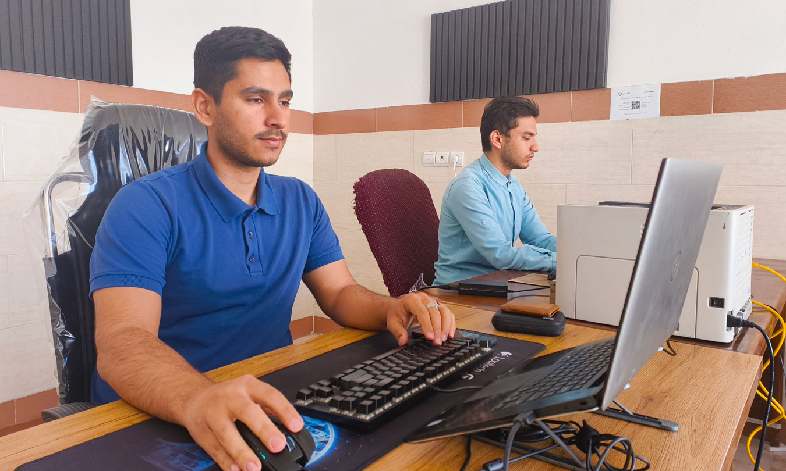

---
aliases:
  - کافی نت در گنبد کاووس
description: کافی نت دی واقع در روستای آق قایه شهرستان گنبد کاووس ارائه دهنده تمامی خدمات کافی نتی به شما عزیزان می باشد.
date: 2025-04-09
tags:
  - وبلاگ
image: ../media/internetcafe-gonbad.jpg
authors:
  - zachshirow
  - hemra
---

پیدا کردن یک کافی نت معتبر و قابل اعتماد برای انجام کارهای اینترنتی تان ممکن است دشوار باشد. ما آمده ایم تا این پروسه را برایتان راحت کنیم. 

## کافی نت دی، کافی نتی روستایی با دسترسی جهانی. 

کافی نت دی واقع در روستای آق قایه شهرستان گنبد کاووس ارائه دهنده تمامی خدمات کافی نتی به شما عزیزان می باشد. 

با اینکه دفتر ما در روستای آق قایه شهرستان گنبد کاووس هست. خدماتی که ارائه می دهیم محدود به این موقعیت مکانی نیست و به لطف وجود اینترنت و شبکه اجتماعی در هر جای جهان که باشید می توانیم به شما خدمت رسانی کنیم.

اما با این حال یک سری خدمات هست که مشتریان عزیز ترجیه می دهند که بتوانند به صورت حضوری به یک کافی نت سر بزنند تا کارشان را انجام دهند. 

کافی نت دی در روستای آق قایه گنبد کاووس واقع شده است. شما عزیزان می توانید در سریعترین زمان ممکن به دور از شلوغی و هیاهوی شهر به ما سر بزنید. 

من، زکریا شیرمحمدلی و برادرم همرا شیرمحمدلی در کافی نت دی در خدمت شما هستیم تا بتوانیم تمامی خدمات کافی نتی را به شما ارائه کنیم. 

## تماس با ما

آدرس ما: 
- استان گلستان، شهرستان گنبد کاووس، روستای آق قایه، خیابان ابوحنیفه، کوچه 4
- [مسیریابی نقشه گوگل](https://www.google.com/maps?ll=37.274082,55.157691&z=14&t=m&hl=en&gl=US&mapclient=embed&cid=7369476349443443522)

شماره های تماس: 
- 09037371958 - زکریا شیرمحمدلی
- 09038632268 - همرا شیرمحمدلی

## وبسایت کافی نت دی

در وبسایت کافی نت دی ما مطالب خوبی در زمینه های مختلف مربوط به کافی نت که برای مشتریان مان مفید هستند آماده و منتشر کرده ایم. همچنین می توانید جزئیات خدمات مختلفی را که در کافی نت دی ارائه می دهیم مشاهده کنید. 

- [وبلاگ ما](/blog)
- [خدمات ما](/services)