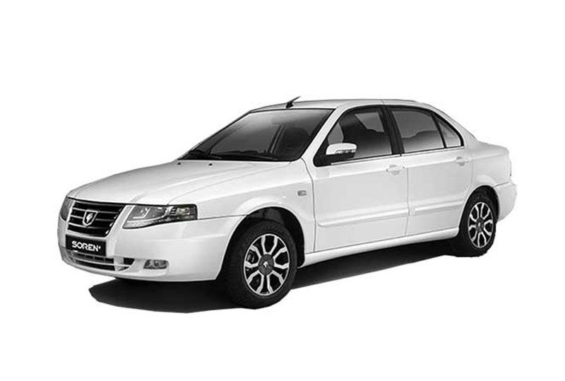
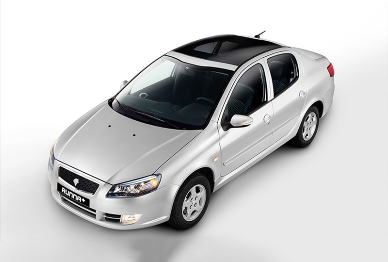
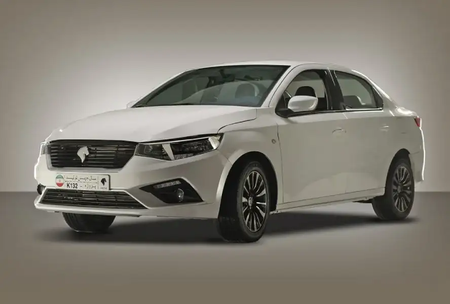
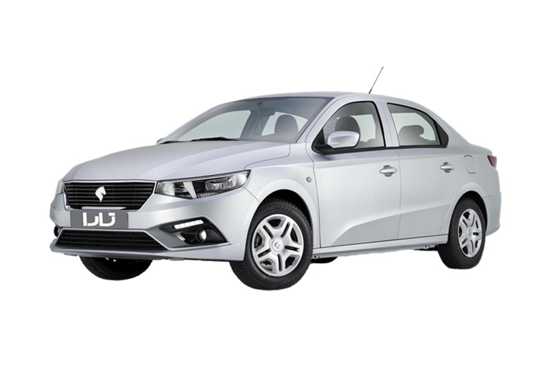
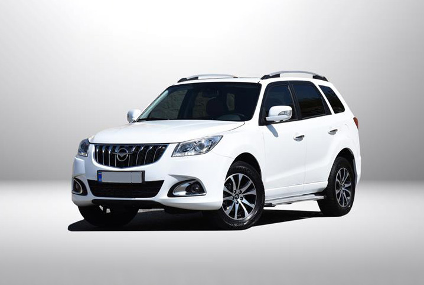
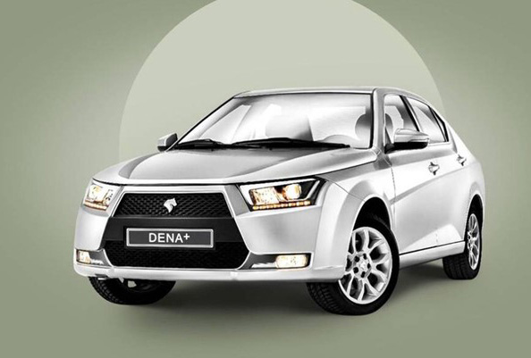

>  ایران خودرو شرایط شرکت در طرح فروش فوق العاده و فوری ۸ محصول محبوب خود را اعلام کرد.

گروه صنعتی ایران‌خودرو به مناسبت دهه فجر ۱۴۰۳ طرح جدید فروش فوق‌العاده و پیش‌فروش محصولات خود را آغاز کرده است. این طرح شامل 1) متقاضیان عادی، 2) مادران مشمول طرح جوانی جمعیت و 3) دارندگان خودروهای فرسوده می‌شود.

## خودرو های عرضه شده

### خودروهای طرح فروش فوق‌العاده (تحویل 90 روزه)

در طرح فروش فوق‌العاده، مبلغ کل ماشین باید در صورت برنده شدن در سایت ایران خودرو پرداخت شود. 

<AstroCard>

**1) سورن پلاس**
- قیمت کارخانه:  615,559,000
- قیمت بازار: 692,000,000
- حاشیه سود: 76,441,000

</AstroCard>

<AstroCard>
**2) پژو 207 دستی با موتور TU3**
- قیمت کارخانه: 590,774,000	
- قیمت بازار: 736,000,000
- حاشیه سود: 145,226,000

</AstroCard>

<AstroCard>
**3) پژو 207 دستی با موتور TU5 رینگ فولادی**
- قیمت کارخانه: 615,828,000
- قیمت بازار: 770,000,000
- حاشیه سود: 154,172,000

</AstroCard>

<AstroCard>
**3) پژو 207 دستی با موتور TU5 پانوراما رینگ آلومینیومی**
- قیمت کارخانه: 655,159,000
- قیمت بازار: 848,000,000
- حاشیه سود: 192,841,000

</AstroCard>

<AstroCard>
**3) پژو 207 دستی با موتور TU5 پانوراما رینگ فولادی**
- قیمت کارخانه: 675,575,000
- قیمت بازار: 868,000,000
- حاشیه سود: 192,425,000

</AstroCard>

<AstroCard>
**4) رانا پلاس ارتقا یافته**
- قیمت کارخانه: 607,722,000	
- قیمت بازار: 692,000,000
- حاشیه سود: 84,278,000

</AstroCard>

<AstroCard>
**5) تارا دستی (V1)**
- قیمت کارخانه: 775,637,000
- قیمت بازار: 886,000,000
- حاشیه سود: 110,327,000

</AstroCard>

<AstroCard>
**6) تارا اتوماتیک (V4)**
- قیمت کارخانه: 901,698,000
- قیمت بازار: 1,056,000,000
- حاشیه سود: 154,302,000

</AstroCard>

<AstroCard>
**7) هایما S7 Pro**
- قیمت کارخانه: 1,396,542,000
- قیمت بازار: 1,895,000,000
- حاشیه سود: 498,458,000

</AstroCard>

<AstroCard>
**8) دنا پلاس اتوماتیک آپشنال**
- قیمت کارخانه: 943,326,000
- قیمت بازار: 1,092,000,000
- حاشیه سود: 148,674,000

</AstroCard>

> توجه: قیمت ها تقریبی است و ممکن هست بالا یا پایین شوند. 

### خودروهای قابل عرضه در طرح پیش‌فروش (تحویل 4 تا 11 ماهه)

در طرح پیش فروش، حداکثر 50% قیمت مصوب فعلی در زمان ثبت نام باید پرداخت شود و الباقی در موعد تحویل بر اساس قیمت روز شرکت محاسبه و دریافت خواهد شد. 

<AstroCard>
**1) پژو 207 دستی با موتور TU5 ( تیپ‌های مختلف)**
- قیمت کارخانه: 615,828,000
- قیمت بازار: 815,000,000
- حاشیه سود: 199,172,000

</AstroCard>

<AstroCard>
**2) دناپلاس دستی با موتور EF7P رینگ فولادی**
- قیمت کارخانه: 717,895,000
- قیمت بازار: 895,000,000
- حاشیه سود: 177,105,000

</AstroCard>

<AstroCard>
**3) دنا پلاس اتوماتیک**
- قیمت کارخانه: 943,326,000
- قیمت بازار: 1,083,000,000
- حاشیه سود: 139,674,000

</AstroCard>

<AstroCard>
**4) رانا پلاس**
- قیمت کارخانه: 607,722,000	
- قیمت بازار: 687,000,000
- حاشیه سود: 79,278,000

</AstroCard>

<AstroCard>

**5) سورن پلاس**
- قیمت کارخانه:  615,559,000
- قیمت بازار: 692,000,000
- حاشیه سود: 76,441,000

</AstroCard>

<AstroCard>
**6) تارا دستی (V1)**
- قیمت کارخانه: 586,828,000
- قیمت بازار: 861,000,000
- حاشیه سود: 274,172,000

</AstroCard>

<AstroCard>
**7) تارا اتوماتیک (V4)**
- قیمت کارخانه: 901,698,000
- قیمت بازار: 1,047,000,000
- حاشیه سود: 145,302,000

</AstroCard>

> توجه: قیمت ها تقریبی است و ممکن هست بالا یا پایین شوند. همینطور قیمت های ذکر شده در جدول قیمت های روز هستند و با توجه به اینکه در طرح پیش فروش، قیمت نهایی در زمان تحویل خودرو محاسبه خواهد شد، قیمت ها امکان دارد تغییر پیدا کنند. 

## زمان های مهم

| توضیحات                                 | تاریخ                                        |
| --------------------------------------- | -------------------------------------------- |
| وکالتی کردن حساب                        | چهارشنبه 17 بهمن 1403 تا یکشنبه 21 بهمن 1403 |
| مهلت ثبت نام                            | یکشنبه 21 بهمن 1403 تا یکشنبه 28 بهمن 1403   |
| رفع مسدودی حسابهای وکالتی               | سه شنبه 30 بهمن 1403                         |
| زمان تحویل خودرو در طرح فروش فوق العاده | 90 روز پس از پذیرش                           |
| زمان تحویل خودرو در طرح پیش فروش        | 4 تا 11 ماه پس از پذیرش                      |

## روش ثبت نام

2. وکالتی کردن حساب - 17 تا 21 بهمن 1403
3. مراجعه به وبسایت ایران خودرو [ikcosales.ir](https://ikcosales.ir)، تکمیل اطلاعات و انتخاب خودرو مورد نظر. - 21 تا 28 بهمن 1403
4. تعیین تکلیف قرعه کشی - 28 تا 30 بهمن 1403
	- انتخاب نام شما به عنوان برنده قرعه کشی. یا، 
	- اعلام اینکه در قرعه کشی برنده نشده اید و سپس آزادسازی مبالغ مسدودی. - 30 بهمن 1403

## شرایط ثبت نام
### شرایط عمومی ثبت نام

- حداقل 18 سال سن.
- متقاضیان طی 2 سال گذشته از ایران خودرو یا سایپا خرید نکرده باشند. 
- عدم امکان ثبت نام برای متقاضیانی که دارای پلاک انتظامی فعال هستند. 
  (البته اگر عمر خودروی شما بیش از 5 سال باشد از این قانون مستثنی هستید.)
- صلح، انتقال امتیاز و حقوق ناشی از خرید خودرو به اشخاص ثالث و فروش حواله خودرو حتی به صورت وکالتی، به هر طریقی ممنوع است.
- وکالتی کردن حساب برای طرح عادی. 

> **وکالتی کردن حساب و بانک های عامل**
> 
> متقاضیان طرح عادی باید حسابشان که مبلغ 300 میلیون  تومان موجودی داشته باشد را در یکی از بانک های عامل وکالتی کنند. بانک های عامل عبارتند از: تجارت، صادرات، ملت، ملی، رفاه کارگران، پارسیان، شهر، سپه، آینده، قرض‌الحسنه مهر ایران، اقتصاد نوین، گردشگری، سینا، کشاورزی، خاورمیانه، سرمایه، پاسارگاد، ایران زمین، قرض‌الحسنه رسالت، توسعه صادرات ایران، دی، مسکن، صنعت و معدن، کارآفرین، سامان، پست بانک، توسعه تعاون و مؤسسه اعتباری ملل

### متقاضیان طرح حمایت از خانواده و جوانی جمعیت (طرح مادران)

- متقاضیان طرح مادران مشمول هیچ یک از شرایط طرح عادی نیستند. 
- باید حداقل دارای 2 فرزند باشند که تاریخ تولد فرزند دوم از تاریخ 1400/08/24 به بعد باشد. 

### متقاضیان طرح جایگزینی خودروهای فرسوده (غیر تاکسی)

- متقاضیان طرح خودرو های فرسوده مشمول هیچ یک از شرایط طرح عادی نیستند. 
- متقاضیان این طرح باید قبل از ثبت درخواست به سایت ستاد نوسازی خودروهای فرسوده مراجعه و نسبت به ثبت اطلاعات شخصی و اطلاعات خودروی فرسوده خود اقدام کنند.
	- سایت ستاد نوسازی خودروهای فرسوده WWW.NNHK.IR

طرح فروش قبلی:

> [ثبت نام جدید ایران خودرو 23 دی ماه 1403](iran-khodro-day-23.md)

---

<BlogCardLink  id="car-signup" collection="services" />