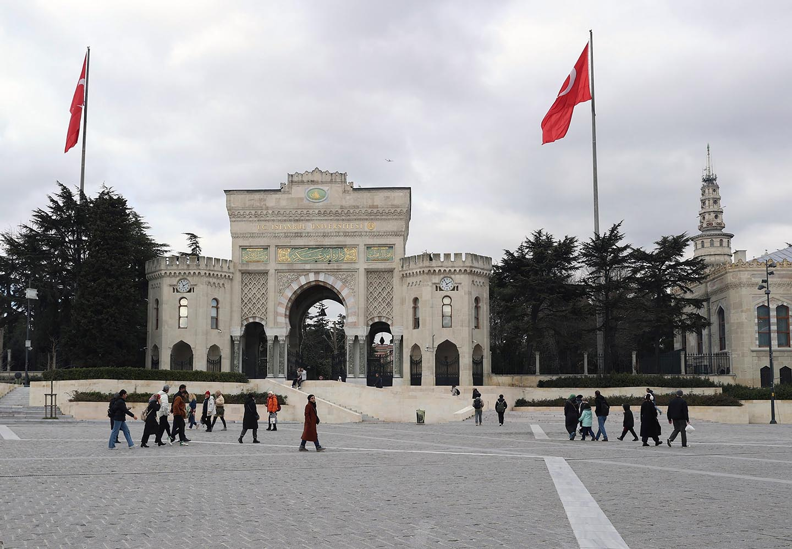

---
aliases:
  - معرفی دانشگاه استانبول
description: در این مقاله به معرفی کامل دانشگاه استانبول برای کسانی که علاقمند به تحصیل در این دانشگاه هستند می پردازیم.
date: 2025-02-03
image: ../media/istanbul-university.jpg
tags:
  - وبلاگ
authors:
  - zachshirow
  - hemra
---

### معرفی دانشگاه استانبول

دانشگاه استانبول دارای 17 دانشکده، 4 مدرسه عالی، 1 مرکز آموزش موسیقی، 14 انستیتو و 14 مرکز تحقیقاتی می‌باشد. در حال حاضر این دانشگاه 74,000 دانشجو و 4,563 عضو کادر علمی دارد که از این تعداد بیش از 47,000 در مقطع کارشناسی، 17,000 در مقطع کارشناسی ارشد و 10,000 دانشجو در مقطع دکترا و فوق دکترا مشغول به تحصیل هستند. همچنین 7,000 دانشجو بین‌المللی دارد که در دوره‌های آموزشی از راه دور دانشگاه استانبول شرکت کرده‌اند.

### رشته‌ها و شهریه

با توجه به اینکه دانشگاه استانبول یک دانشگاه دولتی است، هزینه تحصیل در آن نسبتاً پایین است. شما می‌توانید در جدول زیر می‌توانید هزینه شهریه سالانه رشته‌های محبوب دانشجویان در سال تحصیلی 2024-2025 را ببینید.

| **نام رشته**                 | **شهریه (لیر)** |
| ---------------------------- | --------------- |
| پزشکی                        | 150.000         |
| دندانپزشکی                   | 100.000         |
| داروسازی                     | 75.000          |
| پرستاری                      | 60.000          |
| زیست شناسی                   | 30.000          |
| فیزیک                        | 30.000          |
| معماری داخلی                 | 45.000          |
| اقتصاد                       | 25.000          |
| مدیریت                       | 25.000          |
| شیمی                         | 30.000          |
| مدیریت لجستیک                | 25.000          |
| زیست شناسی مولکولی و ژنتیک   | 30.000          |
| روانشناسی                    | 22.000          |
| علوم سیاسی و روابط بین الملل | 25.000          |
| جامعه شناسی                  | 22.000          |
| مدیریت توریسم                | 25.000          |
| حقوق                         | 50.000          |
| زبانشناسی                    | 22.000          |
| حقوق                         | 50.000          |
| سیستم های مدیریت اطلاعات     | 25.000          |
| روزنامه نگاری                | 25.000          |
### تاریخ ثبت‌نام

تاریخ ثبت‌نام دانشگاه استانبول از 10 تیر تا 28 تیر ماه (1 ژوئیه تا 19 ژوئیه) می‌باشد. نتایج در 30 مرداد (21 آگوست) اعلام خواهند شد.

### حداقل امتیازهای مورد نیاز برای پذیرش

- [آزمون یوس](yos-exam.md)- 300 از 500 امتیاز

- [آزمون تومر](tomer-exam.md) - 65 از 100 امتیاز

### مدارک مورد نیاز برای ثبت‌نام

<Snippets id="turkey-required-docs" />

### آدرس دانشگاه استانبول

دانشگاه استانبول در محله فاتیح استانبول قرار دارد. برای دیدن آدرس این دانشگاه روی نقشه به لینک زیر مراجعه نمایید:

[دانشگاه استانبول در گوگل مپس](https://www.google.com/url?sa=t&rct=j&q=&esrc=s&source=web&cd=&cad=rja&uact=8&ved=2ahUKEwiB6rPZ6KaLAxXmVEEAHRCeKyUQ_BJ6BAg_EAo&url=%2Fmaps%2Fplace%2FIstanbul%2BUniversity%2Fdata%3D!4m2!3m1!1s0x0%3A0x4f51928bdbcd627a%3Fsa%3DX%26ved%3D1t%3A2428%26ictx%3D111&usg=AOvVaw1P6bV_WULenFyXeOby-oPA&opi=89978449)

### دیگر دانشگاه‌های ترکیه

برای کسب اطلاعات درباره دیگر دانشگاه‌های ترکیه به صفحه زیر مراجعه نمایید.

[study-in-turkey](study-in-turkey.md)