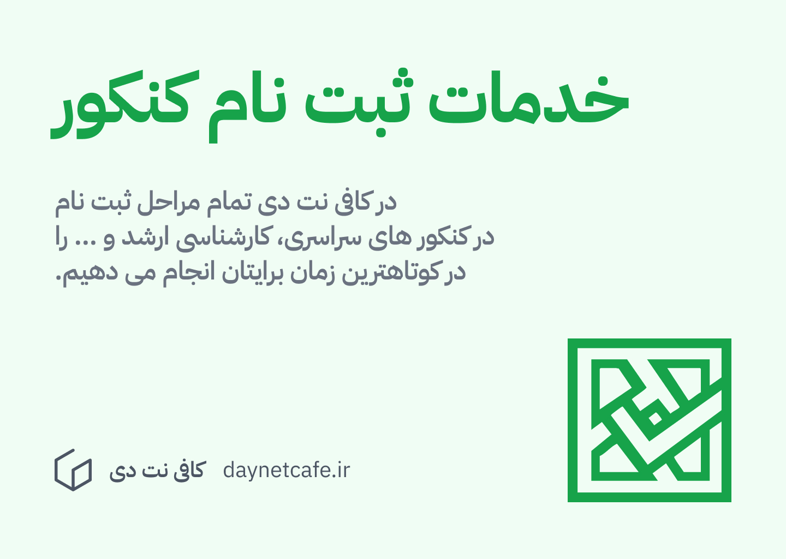

کنکور سراسری هر ساله برای رقابت میان رشته های دانشگاهی پرمتقاضی گروه های آزمایشی ریاضی، تجربی، انسانی، هنر و زبان در دانشگاه های سراسری و آزاد به صورت هماهنگ برگزار می گردد.

بر اساس اطلاعیه سازمان سنجش، مهلت ثبت نام نوبت اول کنکور سراسری 1404، از 25 آذر تا 4 دی 1403 بود. مهلت ثبت نام نوبت دوم کنکور سراسری 1404 نیز، در  نیمه دوم اسفند ماه 1403 در پورتال کاربری داوطلبان در سایت سنجش به آدرس my.sanjesh.org می باشد. در این مقاله به مرور جزئیات هر دو نوبت کنکور که در سال 1404 برگزار می شود خواهیم پرداخت. 

## دفترچه کنکور 1404

برای اطمینان از اینکه به خوبی برای کنکور آماده می شوید، توصیه می شود که دفترچه مربوطه را به صورت دقیق مطالعه کنید: 

- [فایل پی دی اف دفترچه نوبت اول کنکور (اردیبهشت 1404)](https://files.daynetcafe.ir/media/2502230738/daftarche-sabtnam-konkur-ordibehesht-1404.pdf)
- فایل پی دی اف دفترچه نوبت دوم کنکور (تیر 1404) - هنوز مشخص نشده است.

## زمان بندی کنکور 1404 

طبق دفترچه نوبت اول کنکور، جدول زیر حاوی زمان بندی ثبت نام و زمان آزمون کنکور می باشد. 

| نوبت                | زمان ثبت نام           | زمان آزمون            |
| ------------------- | ---------------------- | --------------------- |
| نوبت اول کنکور 1404 | از 25 اذر تا 4 دی 1403 | 11 و 12 اردیبهشت 1404 |
| نوبت دوم کنکور 1404 | نیمه دوم اسفند ماه     | 5 و 6 تیر 1404        |

## سایت ثبت نام کنکور

- برای ثبت نام کنکور می توانید به سامانه [my.sanjesh.org](https://my.sanjesh.org) مراجعه کنید. 
- برای پرداخت هزینه ثبت نام در هر رشته کنکور باید به سامانه [https://epay.sanjesh.org/payment/](https://epay.sanjesh.org/payment/) مراجعه کنید. 
## شرایط ثبت نام کنکور

شرایط عمومی

1. اعتقاد به دین اسلام يا يكی از اديان مصرحه در قانون اساسی
2. عدم دشمنی و مخالفت با نظام جمهوری اسلامی ایران
3. نداشتن سابقه عضويت در سازمان های غيرقانونی، فراماسونری
4. عدم احراز فساد اخلاقی
5. عدم اعتياد به مواد مخدر

شرایط اختصاصی

1. داشتن دیپلم چهار ساله نظام قدیم، مدرک پیش دانشگاهی، مدرک کاردانی (فوق دیپلم)، دیپلم پایه دوازدهم نظام جدید
2. فارع التحصیلی برای رشته هایی که پذیرش آن ها در نیمسال اول تا 31 شهریور ۱۴۰۴
3. فارغ التحصیلی برای رشته هایی که پذیرش آن ها در نیمسال دوم تحصیلی می باشد تا 30 بهمن ماه می باشد. 

## مدارک مورد نیاز برای ثبت نام کنکور

1. اسکن عکس 3 در 4 داوطلب
2. شناسنامه و کارت ملی جهت وارد کردن اطلاعات فردی شناسنامه ای
3. کارنامه دیپلم و پیش دانشگاهی
4. آدرس و شماره تماس و کد پستی محل سکونت
5. کد سوابق تحصیلی دیپلم و پیش دانشگاهی
6. کد منطقه آموزش و پرورش محل اخذ مدرک دیپلم
7. [کد عنوان دیپلم](#لیست کد عنوان دیپلم)
8. کد نظام وظیفه
9. کد دانش آموزی داوطلب
10. کد عنوان پیش دانشگاهی

### لیست کد عنوان دیپلم

تمامی کدهای عنوان دیپلم نظری و فنی و کاردانش در دفترچه راهنمای ثبت نام کنکور سراسری سازمان سنجش منتشر می شوند و دانش آموزان می توانند این کدها را با دانلود دفترچه راهنمای ثبت نام کنکور دریافت نمایند. در جدول زیر کدهای عنوان دیپلم هر یک از رشته های مجاز در ثبت نام کنکور ذکر شده است.

| نام دیپلم                           | کد دیپلم |
| ----------------------------------- | -------- |
| رشته ریاضی و فیزیک                  | 10       |
| رشته علوم تجربی                     | 11       |
| رشته ادبیات و علوم انسانی           | 12       |
| کلیه رشته های کاردانش و فنی حرفه ای | 13       |
| رشته ماشین آلات کشاورزی             | 16       |
| رشته مدیریت روستایی و کشاورزی       | 17       |
| رشته صنایع غذایی کشاورزی            | 17       |
| رشته کشاورزی عمومی                  | 17       |
| رشته علوم و معارف اسلامی            | 18       |
| سایر دیپلم ها                       | 20       |
| فنی حرفه ای (نظام آموزشی جدید)      | 21       |
| کاردانش (نظام آموزشی جدید)          | 22       |

## مراحل ثبت نام برای کنکور 1404

1. مراجعه به سامانه سنجش به آدرس https://my.sanjesh.org
2. ایجاد حساب کاربری و ثبت رمز عبور
3. ورود به حساب کاربری با کد ملی و رمز عبور
4. تکمیل اطلاعات تماس و محل سکونت داوطلب در سامانه
5. کلیک روی ثبت نام جدید و طی کردن مراحل ثبت نام
	- هر کدام از زیرشاخه های کنکور یک ثبت نام حساب می شود و باید برای هر کدام یک پرداخت در سامانه https://epay.sanjesh.org/payment/ باشید و کد رهگیری این پرداخت را در سامانه وارد کنید. 
6. دریافت تاییدیه ثبت نام در کنکور حاوی اطلاعات کامل متقاضی و رشته های امتحانی
7. تایید نمرات دبیرستان در سامانه

## انجام صفر تا صد ثبت نام کنکور 1404 در کافی نت دی

در کافی نت دی تمام مراحل ثبت نام کنکور که گاها ممکن است سخت و پیچیده باشد را برایتان انجام می دهیم. برای بررسی جزئیات این خدمت از کافی نت دی، روی لینک زیر کلیک کنید. 

[خدمات ثبت نام کنکور](../services/konkoor-signup.md)