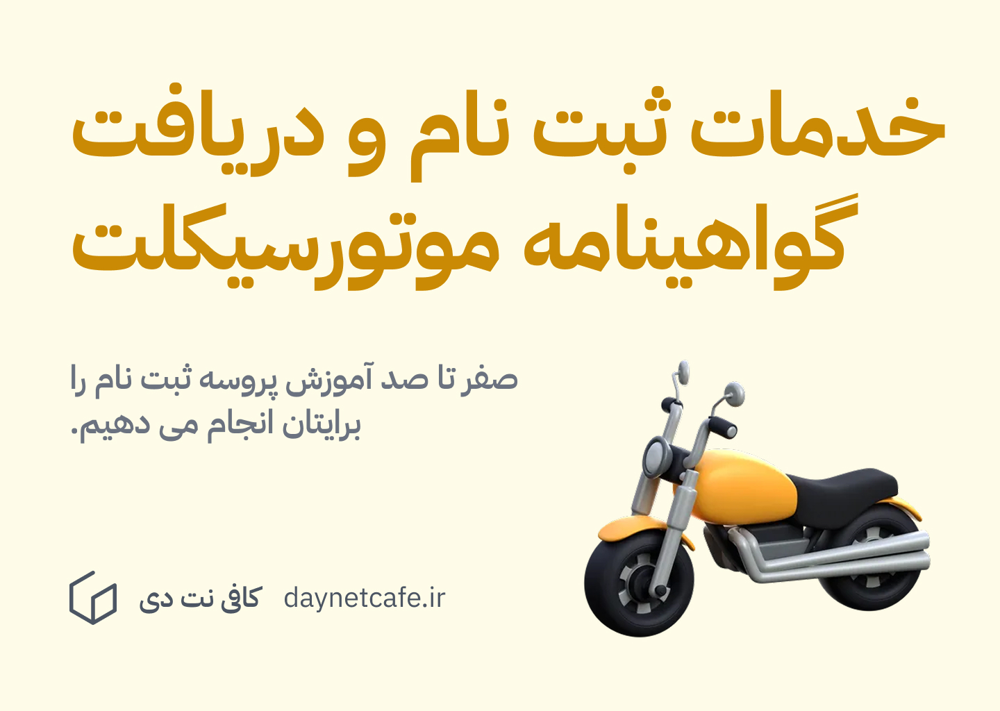

## معرفی طرح گواهینامه موتور سیکلت یک روزه

نداشتن گواهینامه موتورسیکلت می تواند عواقب جبران ناپذیر زیادی را به همراه داشته باشد. اما همواره دریافت این گواهینامه سختی های فراوانی داشته است. به همین دلیل، پلیس ناجا تصمیم گرفته تا این پروسه را آسان کند و بنابراین طرح گواهینامه موتور سیکلت یک روزه را ایجاد کرده است. 

در این پست 0 تا 100 ثبت‌نام گواهینامه موتور سیکلت یک روزه را توضیح خواهیم داد.
## مدارک مورد نیاز

قبل از شروع به ثبت‌نام مطمئن شوید که مدارک مورد نیاز برای ثبت‌نام را در دست دارید:

- کارت ملی
- شماره تلفن به نام
- کارت موتورسیکلت (اگر این مورد را ندارید، در کافی نت دی برایتان تهیه می کنیم.)

## پروسه ثبت نام گواهینامه موتورسیکلت یک روزه
### مرحله 1) ثبت نام در سامانه سخا و احراز هویت در پلیس +10

توجه داشته باشید که برای ثبت‌نام گواهینامه موتور سیکلت یک روزه باید در سامانه سخا اطلاعات فردی شما ثبت شده باشد. همچنین گواهینامه شما به آدرس ثبت شده در سامانه سخا ارسال خواهد شد، به این دلیل قبل از شروع ثبت‌نام از صحیح بودن اطلاعات ثبت شده خود در سامانه سخا اطلاع حاصل نمایید.

برای ورود به سامانه سخا به آدرس زیر مراجعه نمایید:
https://sakha.epolice.ir

همینطور باید شما قبل از ثبت نام برای گواهینامه، به نزدیک ترین پلیس +10 مراجعه کنید و در آنجا احراز هویت انجام بدهید. شاید نیاز باشد که در آنجا یک عکس از شما بگیرند و همینطور نام و نام خانوادگی تان را به انگلیسی ثبت کنند. دلیل این موضوع این هست که در گواهینامه های جدید، نام و نام خانوادگی تان به انگلیسی نیز نوشته می شود. 

### مرحله 2) ثبت نام در سامانه ایرانیان موتور

مرحله بعدی این هست که به سامانه ایرانیان موتور به آدرس [https://iranianmotorco.ir](https://iranianmotorco.ir) و در این سامانه بعد از ایجاد حساب کاربری، برای گواهینامه موتورسیکلت ثبت نام کنید. 

ثبت نام در این سامانه دارای قدم های زیر است: 

1. قوانین و مقررات
2. تعهدنامه
3. ثبت وسیله نقلیه
4. تایید مشخصات فردی
5. انتخاب آموزشگاه
6. رزرو نوبت
7. انتخاب درگاه پرداخت

توضیحات هر کدام از این گام ها در ادامه آورده شده است. 

**قوانین و مقررات**

شرایط عمومی

1. آقایان داشتن حداقل 18 سال تمام.
2. دریافت گواهی سلامت جسمی و روانی پزشک معاین.
3. شرکت در دوره‌های آموزشی از آموزشگاه
4. قبول شدن در آزمون‌های تئوری آیین نامه و مهارت علمی.
5. این طرح ویژه دارندگان موتورسیکلت می‌باشد.
   
شرايط اختصاصی

1. داشتن مالکیت موتور سیکلت (پلاک به نام فرد) یا متصرف قانونی با ارائه مدارک (پلاک به نام شخص دیگری باشد).
2. بارگذاری اسناد موتور سیکلت در سامانه برابر روش اعلامی.
3. عدم ثبت درخواست اخذ گواهینامه در سایر آموزشگاهها به هنگام شرکت در طرح مذکور.
4. در صورتیکه معافیت پزشکی داشته باشم پزشک معاین را مطلع نمایم در صورت عدم اطلاع کلیه عواقب با اینجانب می‌باشد.
5. در صورتیکه شما درخواست جدیدی جهت تمدید گواهینامه دارید ابتدا آن‌ را تکمیل نموده سپس بعد از دریافت  گواهینامه درخواستی جدید اقدام به ثبت‌نام گواهینامه موتورسیکلت نمایید.

**تعهدنامه**

**ثبت وسیله نقلیه**

در این صفحه باید اطلاعات موتور سیکلت خود را وارد نمایید. در کادر بالا باید شماره کارت vin موتور سیکلت را وارد کرده، و در کادر پایین شماره پلاک خود را وارد نمایید. 

نیازی نیست که این وسیله نقلیه حتما به نام شما باشد.

**تایید مشخصات فردی**

در این قسمت اطلاعات مشخصات فردی خودتان را مشاهده کنید و در صورت درست بودن تایید کنید.

**انتخاب آموزشگاه**

نزدیک ترین آموزشگاه طبق شرایط خودتان را در این قسمت باید انتخاب کنید. در شهرهایی مثل گنبد کاووس که آموزشگاه موتورسیکلت ندارند، هر ماه یا هر هفته طبق متقاضیانی که ثبت نام می کنند، از شهرهای دیگر یک افسر به این شهر ها فرستاده می شود. این افسر سپس از کسانی که برای امتحان جمع شده اند آزمون می گیرد. 

البته توصیه می شود که در صورت امکان به شهرهایی مراجعه کنید که خودشان آموزشگاه رانندگی موتورسیکلت دارند و در این مراکز آزمون دهید. 

> برای مشاهده آموزشگاه های رانندگی استان گلستان [به این پست](golestan-driving-schools.md) مراجعه کنید. 

**رزرو نوبت**

در این قسمت باید تاریخ و زمان آزمون گواهینامه موتورسیکلت را مشخص کنید. 

**انتخاب درگاه پرداخت**

مرحله آخر، پرداخت مبلغ ثبت نام برای دریافت گواهینامه موتورسیکلت می باشد. این پرداخت را می توانید یا خودتان انجام بدهید یا اینکه از کافی نت دی بخواهید برایتان انجام بدهیم. 

### مرحله 3) مراجعه به پزشک جهت معاینه چشم

قبل از اینکه بتوانید در آزمون موتورسیکلت شرکت کنید باید از یکی از پزشکانی که از طرف راهنمایی و رانندگی مشخص شده اند، گواهی معاینه چشم بگیرید. برای مشاوره جهت دریافت این گواهی می توانید با ما تماس بگیرید. 

### مرحله 4) دریافت کارتکس آزمون (حاوی اطلاعات زمان برگزاری آزمون)

در این مرحله تاریخ، زمان، و محل آزمون گواهینامه موتورسیکلت شما مشخص می شود که آن را می توانید از یک کافی نت دریافت کنید. 

### مرحله 5) شرکت کردن در آزمون

در این مرحله با در دست داشتن کارتکس امتحان باید در زمان و مکانی که آزمون موتورسیکلت برگزار می شود حاضر شوید. برای این آزمون حتما نیازی نیست که موتورسیکلت خودتان همراه تان باشد. بلکه می توانید از موتورسیکلت خود آموزشگاه و یا موتورسیکلت هایی که سایر شرکت کنندگان آورده اند استفاده کنید. 

توصیه می شود که علاوه بر کارتکس امتحان، مدارک هویتی خودتان و نیز وسیله نقلیه تان نیز همراه تان باشد. 

### مرحله 6) قبول شدن در آزمون و دریافت گواهینامه موتورسیکلت

پس از اینکه در آزمون موتورسیکلت شرکت کردید و قبول شدید، برای دریافت گواهینامه از طریق پست منتظر باشید. این پروسه معمولا یک ماه طول می کشد. 

---

## ثبت نام گواهینامه موتورسیکلت یک روزه در کافی نت دی

در کافی نت دی ما صفر تا صد کارهای ثبت نام و دریافت موتورسیکلت را برایتان انجام می دهیم. برای مشاهده جزئیات این خدمت می توانید روی لینک زیر کلیک کنید. 

[ثبت نام گواهینامه موتورسیکلت یک روزه](../services/motor-license-signup.md)

