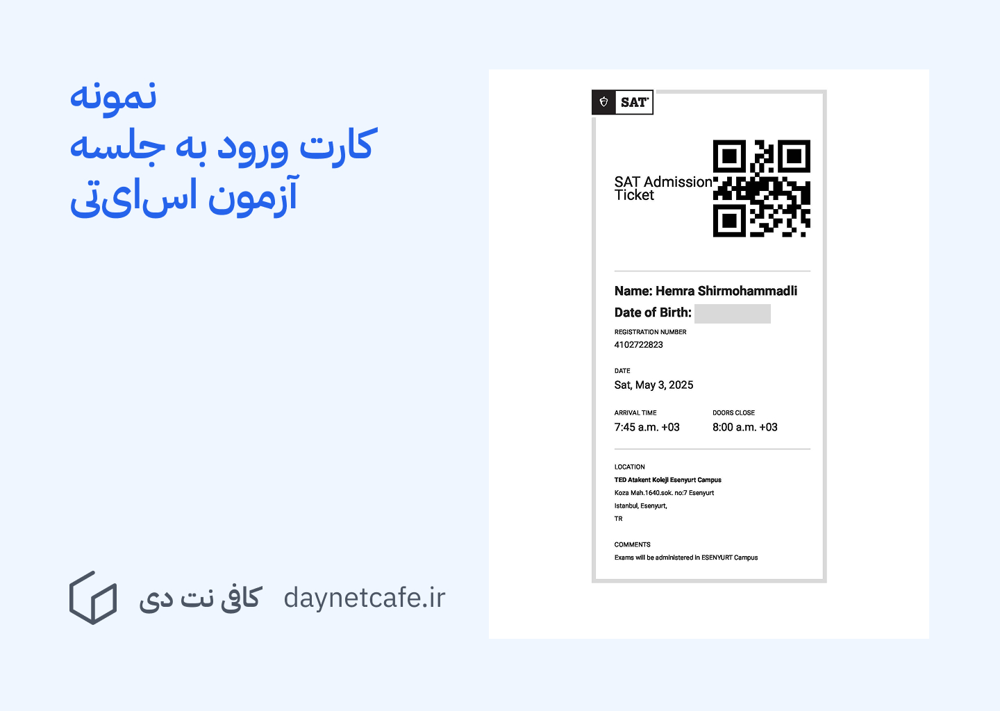

---
aliases:
  - صفر تا صد مراحل شرکت در آزمون اس ای تی
description: در این مقاله ۵ نکته مهم که باید قبل از شرکت در آزمون تهیه کنید را برایتان یادداشت کرده ایم.
date: 2025-05-24
tags:
  - وبلاگ
  - آزمون
  - sat
image: ../media/sat-exam-procedure-0-100.jpg
authors:
  - zachshirow
  - hemra
---

آزمون SAT یکی از آزمون‌های معتبر بین‌المللی برای ورود به دانشگاه‌های آمریکایی و بسیاری دیگر از دانشگاه‌های معتبر جهان است. اگر شما هم در مسیر اپلای هستید، احتمالاً با این آزمون آشنایی دارید یا حتی در آن ثبت‌نام کرده‌اید. اما شاید اکنون با نزدیک شدن به روز آزمون کمی نگران باشید و بخواهید همه چیز را از قبل آماده داشته باشید.

پس از اینکه [برای آزمون اس‌ای‌تی ثبت نام انجام دادید](../services/sat-exam-signup-services.md) مراحل و نکاتی که در این مقاله نوشته ایم به شما کمک خواهند کرد. 

نگران نباشید! در این پست، تمام نکات مهمی که باید درباره آزمون SAT بدانید، از دریافت برگه ورود تا آماده شدن برای جلسه آزمون را با هم مرور می‌کنیم. 

## همه چیز درباره آزمون SAT: از آمادگی تا روز آزمون

### ۱. کارت ورود به آزمون را دریافت کنید

۵ روز قبل از تاریخ برگزاری آزمون، می‌توانید Admission Ticket یا همان کارت ورود به جلسه را از حساب کاربری خود در سایت [College Board](https://satsuite.collegeboard.org) دریافت کنید.

- حتماً این برگه را دانلود و چاپ کنید و در روز آزمون همراه داشته باشید.
- بدون این برگه، ورود شما به جلسه آزمون ممکن نخواهد بود.
- پاسپورت یا کارت شناسایی معتبر را فراموش نکنید، چون بدون آن اجازه ورود نخواهید داشت.

نمونه کارت ورود به جلسه آزمون اس‌ای‌تی:

### ۲. برنامه Bluebook را نصب کنید

آزمون SAT به‌صورت دیجیتال و از طریق برنامه‌ای به نام Bluebook برگزار می‌شود.

- پیش از روز آزمون، این برنامه را روی لپ‌تاپ شخصی خود نصب و راه‌اندازی کنید.
- مراکز آزمون معمولاً دستگاه یا رایانه‌ای برای استفاده داوطلبان فراهم نمی‌کنند، پس حتماً لپ‌تاپ خود را همراه ببرید.

نکات مهم درباره دستگاه شما:

- باتری آن را کاملاً شارژ کنید، چون ممکن است به پریز برق دسترسی نداشته باشید.
- قبل از شروع آزمون، تمامی برنامه‌های دیگر را ببندید. داشتن برنامه‌های باز دیگر ممکن است به عنوان تقلب در نظر گرفته شود.
- در روز آزمون باید به وای‌فای مرکز آزمون متصل شوید.

> [دانلود نرم افزار Bluebook](https://bluebook.collegeboard.org/students/download-bluebook)

### ۳. در آزمون‌های تمرینی شرکت کنید

در اپلیکیشن Bluebook می‌توانید تا ۶ آزمون تمرینی را رایگان انجام دهید. این آزمون‌ها از سوالات سال‌های قبل استفاده می‌کنند و فرصت بسیار خوبی برای آشنایی با ساختار آزمون، نوع سوالات، و مدیریت زمان است. 

پس از هر آزمون تمرینی، نمره شما محاسبه می‌شود و برای همه سوالات، پاسخ تشریحی ارائه خواهد شد. این یکی از بهترین روش‌ها برای آمادگی است.

### ۴. با آمادگی کامل سر جلسه حاضر شوید

برای اینکه بدون استرس در آزمون حاضر شوید:

- حداقل ۳۰ دقیقه زودتر از زمان شروع، در مرکز آزمون حضور داشته باشید.
- آب و خوراکی همراه داشته باشید تا در زمان استراحت استفاده کنید.
- زمان آزمون از ورود تا خروج از مرکز حدود سه ساعت خواهد شد، پس مطمئن باشید که گرسنه یا خسته نیستید.
  
### ۵. ماشین حساب را فراموش نکنید

خوشبختانه استفاده از ماشین حساب در بخش ریاضی آزمون SAT مجاز است.

- می‌توانید یک ماشین حساب شخصی همراه داشته باشید.
- همچنین برنامه Bluebook خودش دارای یک ماشین حساب پیشرفته داخلی است که در طول آزمون قابل استفاده است.

### ۶. امتیازدهی آزمون اس‌ای‌تی

شیوه امتیازدهی آزمون اس‌ای‌تی با آزمون‌های دیگری مانند کنکور بسیار متفاوت است. نمره‌ای که شما از هر سوال دریافت خواهید کرد متفاوت است، و برخلاف تصورتان، سوالات آسان بسیار بیتشر از سوالات سخت ارزش دارند. این یعنی اینکه اگر شما یک سوال آسان را اشتباه جواب دهید ممکن است ۴۰ تا ۵۰ امتیاز از نمره نهایی شما کثر شود، ولی ممکن که دو جواب اشتباه در سوالات سخت فقط ۱۰ امتیاز از نمره نهایی شما کثر کند. این نوع امتیازدهی به این دلیل است که این آزمون می‌خواهد توانایی پایه‌ای شما را بسنجد.

همچنین به یاد داشته باشید که آزمون اس‌ای‌تی نمره منفی ندارد، پس همه سوالات را پاسخ دهید، حتی اگر حدسی باشد. 

با رعایت این نکات، می‌توانید با آمادگی و اعتماد به‌نفس بیشتری در آزمون SAT شرکت کنید. موفق باشید!

### ثبت نام در آزمون اس‌ای‌تی در کافی نت دی

با توجه به تجربیات و امکاناتی که در کافی نت دی داریم، صفر تا صد مراحل ثبت نام در آزمون اس‌ای‌تی را برایتان انجام می دهیم و در این مسیر به شما کمک می کنیم. برای بررسی جزئیات این خدمت می توانید به صفحه زیر مراجعه کنید. 

[خدمات ثبت نام در آزمون اس‌ای‌تی (SAT)](../services/sat-exam-signup-services.md)