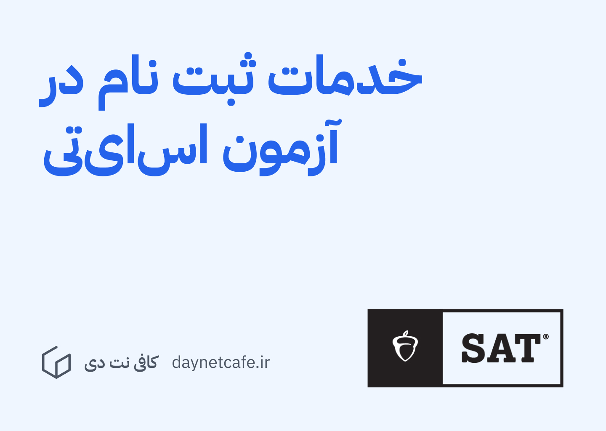

## همه چیز درباره آزمون SAT: از آمادگی تا روز آزمون

آزمون اس‌ای‌تی یک آزمون بین‌اللملی است که توسط کشور آمریکا برگزار می‌شود. امتیاز این آزمون برای اخذ پذیرش در بسیاری از دانشگاه‌های خارجی قابل قبول و مورد نیاز است. 

این آزمون فقط به زبان انگلیسی برگزار می‎‌شود.

برای ثبت‌نام در این آزمون باید به سامانه زیر مراجعه شود:
https://satsuite.collegeboard.org

متاسفانه این آزمون در ایران برگزار نمی‌شود. می‌توانید برای شرکت در این آزمون یکی از کشورهای همسایه، از جمله ترکیه، را انتخاب کنید.

هزینه ثبت‌نام در این آزمون 110$ دلار آمریکا بوده، و با کارت بانکی بین‌اللملی یا پی‌پل قابل پرداخت است. 

## تاریخ ثبت‌نام و برگزاری آزمون

 این آزمون سالانه 6 بار برگزار می‌شود. آزمون‌های آینده در این تاریخ‌ها برگزار خواهند شد:

| تاریخ آزمون                       | مهلت ثبت‌نام                            | مهلت لغو ثبت‌نام و ثبت‌نام با تاخیر |
| --------------------------------- | --------------------------------------- | ----------------------------------- |
| ۱ شهریور، ۱۴۰۴ Aug. 23, 2025   | ۱۷ مرداد، ۱۴۰۴ Aug. 8, 2025          | ۲۱ مرداد، ۱۴۰۴ Aug. 12, 2025  |
| ۲۲ شهریور، ۱۴۰۴ Sept. 13, 2025 | ۷ شهریور، ۱۴۰۴ Aug. 29, 2025         | ۱۱ شهریور، ۱۴۰۴ Sept. 2, 2025    |
| ۱۲ مهر، ۱۴۰۴ Oct. 4, 2025      | ۲۸ شهریور، ۱۴۰۴ Sept. 19, 2025    | ۱ مهر، ۱۴۰۴ Sept. 23, 2025       |
| ۱۷ آبان، ۱۴۰۴ Nov. 8, 2025     | ۲ آبان، ۱۴۰۴ Oct. 24, 2025        | ۶ آبان، ۱۴۰۴ Oct. 28, 2025       |
| ۱۵ آذر، ۱۴۰۴ Dec. 6, 2025      | ۳۰ آبان، ۱۴۰۴ Nov. 21, 2025       | ۴ آذر، ۱۴۰۴ Nov. 25, 2025        |
| ۲۳ اسفند، ۱۴۰۴ March 14, 2026  | ۸ اسفند، ۱۴۰۴ Feb. 27, 2026       | ۱۲ اسفند، ۱۴۰۴ March 3, 2026     |
| ۱۲ اردیبهشت، ۱۴۰۵ May 2, 2026  | ۲۸ فروردین، ۱۴۰۵ Apr. 17, 2026    | ۱ اردیبهشت، ۱۴۰۵ April 21, 2026  

## آشنایی با سوالات آزمون اس‌ای‌تی

آزمون اس‌ای‌تی شامل 98 سوال می‌باشد. این سوال‌ها به دو بخش تقسیم شده‌اند: 54 سوال خواندن و نوشتن، 44 سوال ریاضی و منطق.

امتیاز شما در این آزمون به چندین فاکتور، از جمله سختی سوال‌ها و اینکه کدام سوال‌ها را درست یا غلط جواب داده باشید است. این به این معنی می‌باشد که حتی اگر دو نفر تعداد جواب صحیح یکسانی داشته باشند، ممکن است که امتیاز نهایی آن‌ها برابر نباشد. 

امتیاز نهایی آزمون بین 400 تا 1600 می‌باشد. برای بسیاری از دانشگاه‌های بین‌المللی حد نصاب پذیرش بین 1200 و 1400 می‌باشد. 

توجه داشته باشید که آزمون اس‌ای‌تی، برخلاف آزمون کنکور یا یوس ترکیه، امتیاز منفی برای جواب‌های اشتباه ندارد. این به این معنی می‌باشد که بهتر است که حتی اگر از صحیح بودن پاسختان اطمینان نداشته باشید هم بهتر است یک گزینه را شانسی بزنید، مخصوصاً اگر می‌توانید یک یا دو گزینه اشتباه را حذف کنید.

برای آشنایی بیشتر با سوالات می‌توانید آزمون‌های قبلی را اینجا مشاهده کنید:

https://mcelroytutoring.com/blog-post.php?id=5138

برای آمادگی بیشتر برای آزمون اس‌ای‌تی می‌توانید کتاب زیر را مطالعه کنید:

> [The Official SAT Study Guide](https://files.daynetcafe.ir/media/2501251401/The%20Official%20SAT%20Study%20Guide.pdf)

## ثبت نام آزمون اس‌ای‌تی در کافی نت دی

در کافی نت دی با تجربه و امکاناتی که داریم می توانیم صفر تا صد مراحل ثبت نام در آزمون اس‌ای‌تی را برایتان انجام دهیم و در این راه به شما کمک کنیم. 

- [خدمات ثبت نام در آزمون اس‌ای‌تی (SAT)](../services/sat-exam-signup-services.md)