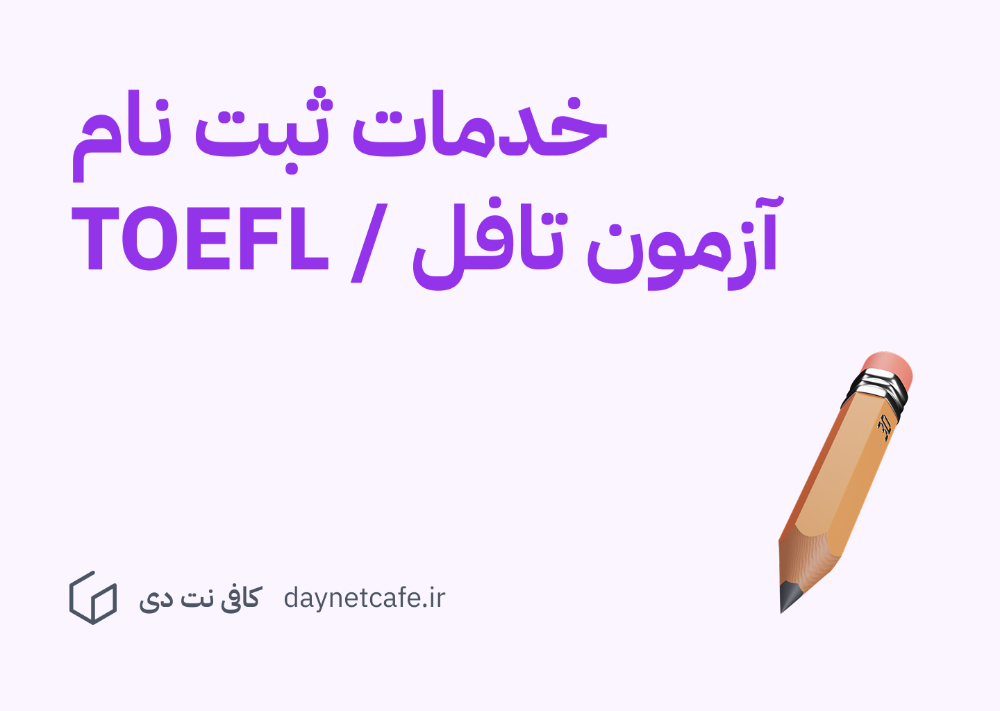

### آزمون تافل چیست؟

می توان آزمون تافل را در کنار آیلتس معتبرترین آزمون زبان بین المللی دانست. ثبت نام تافل توسط [ets](https://ets.org/mytoefl)  و آیلتس توسط [British Council](https://ielts.britishcouncil.org/) انجام می شود. برای ثبت نام در دانشگاه های ترکیه معمولاً آزمون تافل نسبت به آزمون آیلتس در اولویت است. 

نام نویسی برای آزمون تافل در سراسر دنیا انجام می شود. در بیش از 120 کشور دنیا آزمون تافل برگزار می گردد. تافل اینترنتی رایج ترین شکل برگزاری آزمون است. البته هنوز تافل کاغذی در [بعضی از نقاط جهان](https://www.ets.org/toefl/rpdt/register/centers_dates/) برگزار می شود. در ایران فقط تافل اینترنتی TOEFL iBT برگزار می شود. هزینه آزمون تافل اینترنتی در ایران 300 دلار است. بنابراین قیمت ارز بر روی هزینه ریالی امتحان تافل اینترنتی تاثیر مستقیم دارد.

### بخش های مختلف آزمون تافل

آزمون تافل به طور معمول با بخش Reading شروع می شود که حدود 35 تا 55 سوال است و 60 الی 90 دقیقه فرصت برای پاسخگویی دارید.

1. بخش Listening آزمون از 35 تا 50 سوال تشکیل شده و 60 الی 80 دقیقه زمان برای پاسخگویی دارید.
2. بخش Writing دو قسمت است . در قسمت اول که حدود 20 دقیقه است به سوالات مطرح شده پاسخ می دهید و در بخش دوم که حدود 30 دقیقه است باید یک متن یا انشا در رابطه با مطلب خواسته شده بنویسید.
3. بخش Speaking باید به سوالاتی که برای شما مطرح می شود پاسخ دهید.

## مراکز برگذاری آزمون تافل در ایران

آزمون تافل در ایران معمولاً در شهر های تهران، اصفهان، تبریز، شیراز، آمل، ارومیه، زنجان و کرمان برگزار می شود.  

مراکز مهم برگزاری آزمون تافل در تهران شامل: سازمان سنجش آموزش کشور، دانشکده علوم پزشکی ، موسسه امیربهادر، موسسه فرهنگی علامه سخن، زبان نگار و معرفت می باشد. با این وجود، ثبت نام تافل توسط این مراکز معمولاً انجام نمی شود. 

### ثبت نام در آزمون تافل با کافی نت دی

یک از خدمات کافی نت دی، ثبت نام متقاضیان در آزمون های بین المللی مثل آزمون تافل می باشد. شما می توانید با مراجعه به صفحه زیر، جزئیات این خدمت را مشاهده کنید. 

[خدمات ثبت نام در آزمون تافل](../services/toefl-signup.md)
