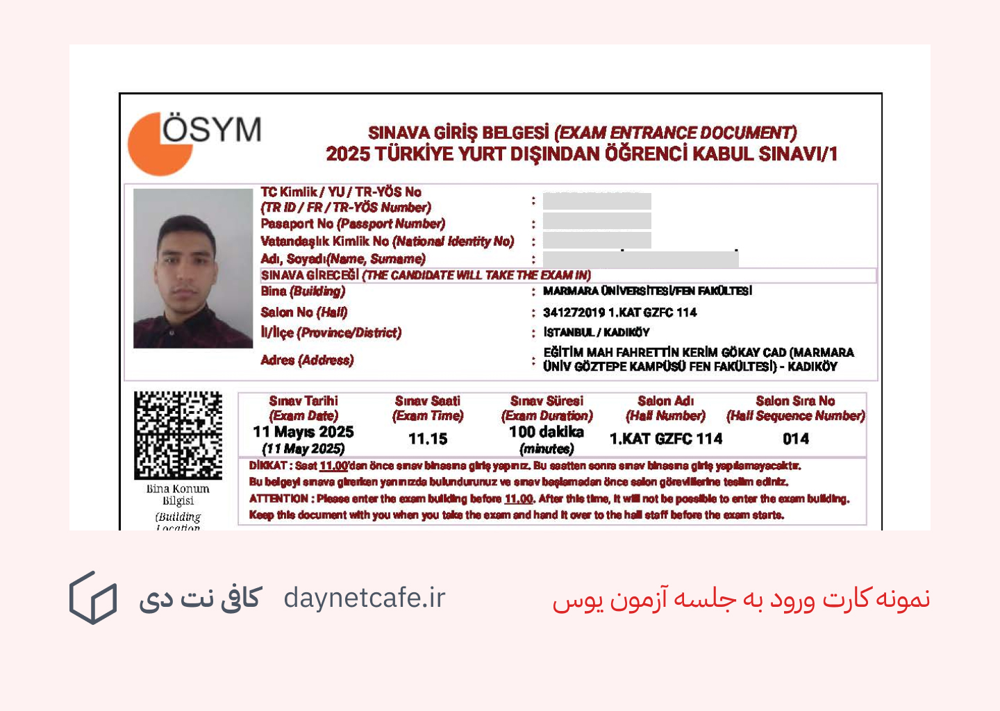

---
aliases:
  - راهنمای جامع شرکت در آزمون یوس (YÖS) ترکیه
description: در این مقاله سعی کرده‌ایم نکات مهم و ریز اما کاربردی برای شرکت در آزمون YÖS را به طور کامل بیان کنیم.
date: 2025-05-24
tags:
  - وبلاگ
image: ../media/yos-exam-procedure.jpg
authors:
  - zachshirow
  - hemra
---

هر ساله تعداد زیادی از داوطلبان بین‌المللی، به ویژه از کشورهای همسایه ترکیه، برای ادامه تحصیل در دانشگاه‌های این کشور در آزمون یوس (YÖS) شرکت می‌کنند. اگر شما هم یکی از این افراد هستید و در این آزمون ثبت‌نام کرده‌اید، احتمالاً سوالاتی درباره مراحل شرکت در آزمون، وسایل مورد نیاز و نحوه برگزاری آن دارید. در این مقاله سعی کرده‌ایم نکات مهم و ریز اما کاربردی برای شرکت در آزمون YÖS را به طور کامل بیان کنیم.

### 1. دریافت کارت ورود به جلسه

چند روز پیش از تاریخ برگزاری آزمون، باید وارد سامانه رسمی آزمون یوس به آدرس [https://tryos.osym.gov.tr](https://tryos.osym.gov.tr) شوید و کارت ورود به جلسه (Giriş Belgesi) خود را دانلود و چاپ کنید. همراه داشتن این برگه در روز آزمون الزامی است. 

نمونه کارت ورود به جلسه:

### 2. مدارک مورد نیاز برای ورود به جلسه

برای ورود به حوزه امتحانی، لازم است دو مورد را همراه داشته باشید:

- کارت ورود به جلسه چاپ‌شده
- پاسپورت یا مدرک شناسایی معتبر

به همراه داشتن هرگونه وسیله اضافی مانند کیف، تلفن همراه، مداد، پاک‌کن، بطری آب یا حتی ساعت مچی، و جواهرات ممنوع است. توجه داشته باشید که در حوزه امتحانی امکان امانت‌گذاری وسایل وجود ندارد. بنابراین، بهتر است از آوردن وسایل اضافی خودداری کنید.

### 3. وسایل آزمون توسط برگزارکنندگان ارائه می‌شود

در ابتدای آزمون، برگزارکنندگان به شما مداد، پاک‌کن و مدادتراش ارائه خواهند داد. بنابراین نیازی به آوردن این وسایل از قبل نیست.

### 4. دقت در ثبت اطلاعات

پیش از شروع آزمون، از شما خواسته می‌شود اطلاعات شخصی‌تان را بر روی دفترچه سوالات و پاسخ‌نامه وارد کنید. حتماً با دقت و طبق مدارک شناسایی خود این اطلاعات را تکمیل نمایید، زیرا هر گونه اشتباه ممکن است در بررسی نتایج شما اختلال ایجاد کند.

### 5. ساختار و زمان آزمون

آزمون یوس شامل دو بخش اصلی است:

- ریاضی: 40 سوال
- هوش (IQ): 40 سوال

مجموعاً 80 سوال در اختیار شما قرار خواهد گرفت و برای پاسخگویی به آن‌ها 100 دقیقه (1 ساعت و 40 دقیقه) زمان خواهید داشت. هر دو بخش به صورت همزمان ارائه می‌شود، بنابراین مدیریت زمان یکی از مهارت‌های کلیدی برای موفقیت در این آزمون است.

### 6. اعلام نتایج

نتایج آزمون معمولاً حدود یک ماه پس از برگزاری از طریق همان سامانه رسمی اعلام می‌شود. پس از انتشار نتایج، می‌توانید با استفاده از حساب کاربری خود به نمرات و جزئیات آن دسترسی پیدا کنید.

آزمون یوس فرصتی مناسب برای ورود به دانشگاه‌های معتبر ترکیه است، اما مانند هر آزمون مهم دیگری، نیازمند آمادگی دقیق و شناخت کامل از فرایند اجرایی آن است. با رعایت نکات ذکرشده در این مقاله، می‌توانید با آرامش و اطمینان بیشتری در روز آزمون حاضر شوید.

برای همه داوطلبان آرزوی موفقیت داریم!

## ثبت نام در آزمون یوس ترکیه در کافی نت دی

در کافی نت دی با توجه به تجربیات و امکاناتی که داریم می توانیم صفر تا صد مراحل ثبت نام در آزمون یوس ترکیه را برایتان انجام دهیم. برای بررسی جزئیات بیشتر این خدمت می توانید به صفحه زیر مراجعه کنید. 

[ثبت نام آزمون یوس](../services/yos-signup.md)