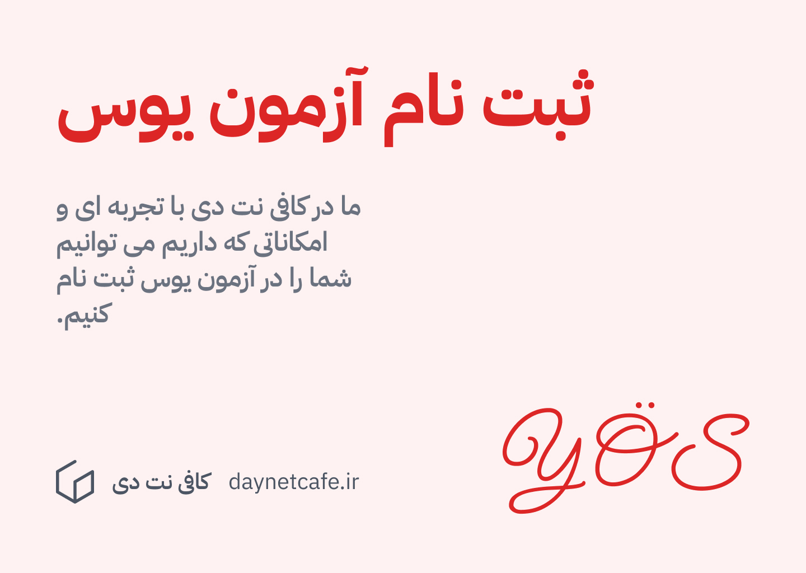

---
aliases:
  - معرفی آزمون یوس ترکیه
  - آزمون یوس
description: در این مقاله به تمام اطلاعاتی که برای شرکت در آزمون یوس نیاز خواهید داشت می پردازیم.
date: 2025-02-01
tags:
  - وبلاگ
  - ترکیه
  - آزمون
  - یوس
image: ../media/yos-exam.jpg
authors:
  - zachshirow
  - hemra
---

### معرفی آزمون یوس

آزمون یوس مخفف یابانجی اورنجی سیناوی می‌باشد، که به معنای آزمون دانش‌آموزان خارجی می‌‍باشد. نتایج این آزمون را تمامی دانشگاه‌های ترکی زبان ترکیه قبول دارند، و با در دست داشتن امتیاز بالا در این آزمون می‌توانید به هر دانشگاه مورد هدفتان اپلای کنید. 

**مباحث آزمون یوس** 

آزمون یوس شامل 80 سوال ریاضی، هندسه، هوش و منطق می‌شود. این سوالات به این صورت تقسیم‌بندی شده‌اند:

- 40 سوال تست هوش یا IQ و منطق
- 10 سوال هندسه
- 30 سوال ریاضی

**محتوا آزمون یوس**

تمامی سوالات آزمون یوس به شکل تستی و پنج گزینه‌ای است. 

زمان پاسخ‌دهی آزمون یوس برابر با 100 دقیقه می‌باشد. توصیه می‌شود که در صورت امکان برای هر سوال بیشتر از یک دقیقه وقت نگذارید و از 20 دقیقه آخر برای بررسی پاسخ‌هایتان استفاده کنید.

سوالات این آزمون به زبان‌های زیر خواهند بود:
- ترکی
- انگلیسی
- آلمانی
- فرانسوی
- روسی
- عربی

نمره نهایی آزمون یوس حداقل 100 امتیاز و حداکثر 500 امتیاز می‌باشد. هر سوال هندسه و ریاضی برابر با 5.5 امتیاز، و هر سوال هوش و منطق برابر با 4.5 امتیاز می‌باشد.

ضمناً در ذهن داشته باشید که مانند آزمون کنکور، آزمون یوس نیز نمره منفی دارد. این به این معنی می‌باشد که برای هر 4 سوالی که اشتباه پاسخ داده باشید، نمره یک پاسخ صحیح از امتیاز کل شما کسر خواهد شد. در نتیجه قبل از پاسخ دادن به سوال از صحیح بودن جوابتان مطمئن شوید که از امتیاز نهایی شما کسر نشود.

به عنوان مثال اگر در قسمت ریاضی و هندسه 34 پاسخ صحیح و 4 پاسخ اشتباه، و در قسمت هوش و منطق 35 پاسخ صحیح و 2 پاسخ اشتباه داشته باشید نمره کل شما این گونه محاسبه خواهد شد:


```
TR-YÖS:

100 + 34 × 5.5 - 4 ÷ 4 × 5.5 + 35 × 4.5 - 2 ÷ 4 × 4.5 = 100 + 187 - 5.5 + 157.5 - 2.25 = 436.75

```


**منابع آزمون یوس**

برای آمادگی برای آزمون یوس میتوانید کتاب‌های زیر را مطالعه نمایید.

[کتاب IQ 1 - YÖS](https://drive.google.com/file/d/161BjfELX0Lgegykl1mjfTW8jDdkVxP82/view?usp=sharing)

[کتاب IQ 2 - YÖS](https://drive.google.com/file/d/1XyU1lzJddjZUwr-7kqnI2lHPosSPRyCz/view?usp=sharing)

[کتاب IQ 3 - YÖS](https://drive.google.com/file/d/1srTdQ7lN8TvnJX4I0gi_zyruxupMH2RY/view?usp=sharing)

[کتاب ریاضی پوزا 1](https://drive.google.com/file/d/1_ZG0fvVK-5zrWQywV63tAGpwiWv1YE34/view?usp=sharing)

[کتاب ریاضی پوزا 2](https://drive.google.com/file/d/1ttUkhvNAngG_qTPRkx4rjLvaRDCd8A8A/view?usp=sharing)

[کتاب هندسه پوزا](https://drive.google.com/file/d/1p8EzqJjvVRRiD4qDRzgcnHA2zIPdizjf/view?usp=sharing)

[کتابچه نمونه سوالات آزمون یوس](https://drive.google.com/file/d/1h9XlhgrZSqsvnsWilJpUtEhOd63Uk9ir/view?usp=sharing)


### نحوه ثبت‌نام در آزمون یوس

برای ثبت‌نام در آزمون یوس باید ابتدا به این سامانه مراجعه کرده و برای خود یک حساب کاربری ایجاد کنید:

https://tryos.osym.gov.tr/TryosYetki/Giris

بعد از ایجاد حساب باید اطلاعات شخصی خود را وارد نموده و سپس برای احراز هویت برنامه زیر را روی موبایلتان نصب کنید:

https://play.google.com/store/apps/details?id=tr.gov.osym.ais.android&hl=en&pli=1


**مدارک موردنیاز برای ثبت‌نام**

1. ریزنمرات دبیرستان
2. مدرک دیپلم یا مدرک اشتغال به تحصیل پایه دوازدهم
3. پاسپورت
4. فیش پرداخت

**مراحل ثبت‌نام آزمون یوس**

1. ایجاد حساب کاربری در سایت OSYM
2. تکمیل فرم ثبت‌نام
3. آپلود مدارک
4. پرداخت هزینه ثبت‌نام
5. دریافت تائیدیه ثبت‌نام 

**هزینه ثبت نام در آزمون یوس**

توجه داشته باشید که هزینه ثبت‌نام در آزمون یوس امسال برابر با 2500 لیر ترکیه می‌باشد.

## آزمون مرتبط: آزمون SAT

توجه داشته باشید که اکثر دانشگاه‌های انگلیسی زبان ترکیه، که معمولاً یک شعبه دانشگاه‌های اروپایی یا آمریکایی هستند، فقط با آزمون اس‌ای‌تی (SAT) پذیرش دارند. برای کسب اطلاعات بیشتر در مورد این آزمون به این صفحه مراجعه نمایید:

[آزمون اس ای تی](sat-exam.md)

## خدمت ثبت نام در یوس



کافی نت دی، ارائه دهنده خدمت ثبت نام در آزمون یوس می باشد. در لینک زیر می توانید اطلاعات مربوطه را مشاهده کنید.

[ثبت نام در آزمون یوس](../services/yos-signup.md)

<BlogCardLink id="" />
